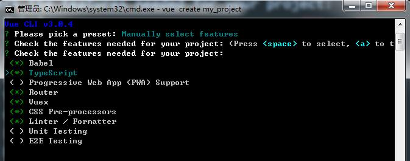

# 使用vue cli 3.0版本快速搭建npm+webpack+vue的项目

## 一、升级vue cli版本
* <pre>npm install -g @vue/cli</pre>
## 二、vue cli 3.0 的搭建步骤
* 1、`vue create my_project`
  
  shift+鼠标右击，打开cmd命令窗口
   
  

* 2、选择项目的配置，可以自定义，也可以选择自己保存过的配置
  
   
  上面的my_custom_vuecli以及my_standard_vuecli_demo是自己之前创建并保存的项目配置

* 3、现在先选择自定义选项
  
   
  `Babel(必选)`：ES6语法编译配置
   
  `TypeScript`：JavaScript的一个超集（添加了可选的静态类型和基于类的面向对象编程：类型批注和编译时类型检查、类、接口、模块、lambda 函数）
   
  `Progressive Web App (PWA) Support`：渐进式Web应用程序
   
  `Router(必选)`：vue-router（vue路由）
   
  `Vuex(必选)`：vuex（vue的状态管理模式）
   
  `CSS Pre-processors(必选)`：CSS 预处理器（如：less、sass）
   
  `Linter/Formatter(必选)`：代码风格检查和格式化（如：ESlint）
   
  `Unit Testing`：单元测试（unit tests）
   
  `E2E Testing`：e2e（end to end） 测试

* 4、`? Use class-style component syntax?` 是否使用class风格的组件语法（Y）
  

* 5、`? Use Babel alongside TypeScript for auto-detected polyfills?` 是否使用babel做转义 (Y)
  

* 6、`? Use history mode for router?` 是否使用历史的路由模式（Y）
  

* 7、`? Pick a CSS pre-processor (PostCSS, Autoprefixer and CSS Modules are supported by default):` 选择CSS 预处理类型(Sass/SCSS)
  

* 8、`? Pick a linter / formatter config:` 选择Linter/Formatter规范类型(TSLint)
  

* 9、`? Pick additional lint features` 选择 保存时检查 / 提交时检查(Lint on save) 
  

* 10、`? Where do you prefer placing config for Babel, PostCSS, ESLint, etc.?` 选择配置信息存放位置，单独存放或者并入package.json(In dedicated config files)
  

* 11、`? Save this as a preset for future projects?` 是否保存当前预设，下次构建无需再次配置(Y)
  

* 以上的所有配置完成即可进入项目
   
  <pre>cd my_project</pre>
  <pre>npm run serve</pre>

* 参考的链接
   
 [参考的链接地址一](https://www.jb51.net/article/138703.htm)
  
 [参考的链接地址二](https://blog.csdn.net/wildye/article/details/80870345)

## 三、vue.config.js的相关配置
* 可参考官方文档：[https://cli.vuejs.org/zh/config/#vue-config-js](https://cli.vuejs.org/zh/config/#vue-config-js)
   
  以下是内容比较全的配置，若是简单的配置可以参考 [https://segmentfault.com/a/1190000016006971](https://segmentfault.com/a/1190000016006971)
  <pre>
    module.exports = {
      // 部署应用包时的基本URL。 
      // https://www.app.com/ => '/'
      // https://www.app.com/my-app/ => '/my-app/'
      // 如果值为空字符串 '' 或者是相对路径 './', 都会被链接为相对路径
      publicPath: '/',
      // 生成环境构建文件的目录。构建时传入 --no-clean 可关闭该行为 
      outputDir: 'dist',
      // 放置生成的静态资源(js, css, img, fonts)d的(相对于 outputDir 的)目录
      assetsDir: '',
      // 指定生成的 index.html 的输出路径 (相对于 outputDir ).也可以是一个绝对路径
      indexPath: 'index.html',
      // 生成的静态资源在它们的文件名中包含了hash以便更好的控制缓存。
      // 如果你无法使用Vue CLI生成的 index THML,你可以通过将这个选项设为 false 来关闭文件名哈希
      filenameHashing: true,
      pages: {
        index: {
          // 页面入口
          entry: 'src/main.js',
          // 模板来源
          template: 'public/index.html',
          // 在 dist/index.html 的输出
          filename: 'index.html',
          // 当使用 title 选项时，
          // template 中的 title 标签需要是 <title><%= htmlWebpackPlugin.options.title %></title>
          title: 'hello-world',
          // 在这个页面中包含的块，默认情况下会包含提取出来的通用 chunk 和 vendor chunk
          chunks: [ 'chunk-vendors', 'chunk-common', 'index']
        },
        // 当使用只有入口的字符串格式时，
        // 模板会被推导为 `public/subpage.html`
        // 并且如果找不到的话，就回退到 `public/index.html`
        // 输出文件名会被推导为 `subpage.html`
        subpage: 'src/main.js'
      },
      // 在生成构建时禁用 eslint-loader
      lintOnSave: process.env.NODE_ENV !== 'production',
      // 是否使用包含运行时编译器的Vue构建版本, 
      // 设置为 true 后你就可以在 Vue 组件中使用 template 选项了，但是这会让你的应用额外增加 10kb 左右
      runtimeCompiler: false,
      // 默认情况下 babel-loader 会忽略所有 node_modules 中的文件。如果你想要通过 Babel 显式转译一个依赖，可以在这个选项中列出来
      transpileDependencies: [],
      // 如果你不需要生产环境的 source map, 可以将其设置为 false 以加速生产环境构建
      productionSourceMap: true,
      // 设置生产的 HTML 中 <link rel="stylesheet"> 和 <script> 标签的 crossorigin 属性
      // 需要注意的是该选项仅影响由 html-webpack-plugin 在构建时注入的标签 - 直接写在模板 (public/index.html) 中的标签不受影响
      crossorigin: undefined,
      integrity: false,
      // 值如果是一个对象，则会通过 webpack-merge 合并到最终的配置中
      // 值如果是一个函数，则会接收被解析的配置作为参数。
      // 该函数及可以修改配置并不返回任何东西，也可以返回一个被克隆或合并过的配置版本。
      // configureWebpack: {
      //   plugins: [
      //     new MyAwesomeWebpackPlugin()
      //   ]
      // },
      configureWebpack: config => {
        if (production.env.NODE_ENV === 'production') {
          // 为生产环境修改配置...
        } else {
          // 为开发环境修改配置...
        }
      },
      // 链式操作 Vue CLI内部的 webpack 配置是通过 webpack-chain 维护的。
      // 这个库提供了一个 webpack 原始配置的上层抽象，使其可以定义具名的 loader 规则和具名插件，并有机会在后期进入这些规则并对它们的选项进行修改
      chainWebpack: config => {
        config.module
          .rule('vue')
          .use('vue-loader')
            .loader('vue-loader')
            .tap(options => {
              // 修改它的选项
              return options
            })
      },
      // 如果想在 js 中作为 CSS Modules 导入 CSS 或其他预处理文件，该文件应该以 *.module.(css|less|sass|scss|styl) 结尾
      // import styles from './foo.module.css'
      // import sassStyles from './foo.module.scss'
      //  如果你想去掉文件名的 .module, 可以设置 vue.config.js 中的 css.modules 为 true
      css: {
        module: true,
        // 提取 CSS 在开发环境模式下是默认不开启的，因为它和 CSS 热重载不兼容。
        // 然而，你仍然可以将这个值显性地设置为 true 在所有情况下都强制提取
        expert: production.env.NODE_ENV === 'production' ? true : false,
        // 是否为 CSS 开启 source map。设置为 true 之后可能会影响构建的性能
        sourceMap: false,
        // 向 CSS 相关的 loader 传递选项
        loaderOptions: {
          css: {
            // 这里的选项会传递给 css-loader
          },
          postcss: {
            // 这里的选项会传递给 postcss-loader
          },
          sass: {
            // 所以这个假设你有 `src/variables.scss`
            // data: `@import "@/variables.scss";`
          }
        }
      },
      devServer: {
        // 在设置让浏览器 overlay 同时显示警告和错误
        overlay: {
          warnings: true,
          errors: true
        },
        proxy: {
          // '/api': {
          //   target: '<url>',
          //   ws: true,
          //   changeOrigin: true
          // },
          // '/foo': {
          //   target: '<other_url>'
          // }
        }
      },
      // 是否为 Babel 或 TypeScript 使用 threa-loader。
      // 该选项在系统的 CPU 有多于一个内核时自动启用，仅作用于生产构建
      parallel: require('os').cpus().length > 1,
      pwa: {
        // 'GenerateSW'(默认), 每次重建 web 应用程序时都会生成一个新的服务工作文件。
        // 'InjectManifest' 允许您从现有的服务工作文件开始，并创建该文件的副本，
        // 并在其中注入 "预先缓存清单"
        workboxPluginMode: 'GenerateSW',
        // workboxOptions:{
        //  swSrc: 'dev/sw.js'
        // }
        // 默认值："名称"字段 package.json 
        // 用作 apple-mobile-web-app-title 生成的 HTML 中元标记的值。请注意，您需要进行编辑 public/manifest.json 才能与之匹配
        // name: '',
        themeColor: '#4DBA87',
        msTileColor: '#000000',
        appleMobileWebAppCapable: 'no',
        appleMobileWebAppStatusBarStyle: 'default',
        // 如果您需要根据浏览器的缓存想 NOT 和 manifest 添加版本，则使用此选项。
        // 这将附加 ?v=<pwa.assetsVersion> 到图标和清单的 URL 。
        assetsVersion: '',
        // 应用程序清单的路径
        manifestPath: 'manifest.json',
        iconPaths: {
          favicon32: 'img/icons/favicon-32x32.png',
          favicon16: 'img/icons/favicon-16x16.png',
          appleTouchIcon: 'img/icons/apple-touch-icon-152x152.png',
          maskIcon: 'img/icons/safari-pinned-tab.svg',
          msTileImage: 'img/icons/msapplication-icon-144x144.png',
        },
      },
      // 这是一个不进行任何 schema(模式) 验证的对象，因此它可以用来传递任何第三方插件选项。
      pluginOptions: {
        foo: {
          // 插件可以作为 `options.pluginOptions.foo` 访问这些选项
        }
      }
    }
  </pre>

  

  