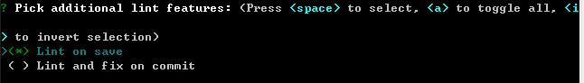

# 使用vue cli 3.0版本快速搭建npm+webpack+vue的项目

## 一、升级vue cli版本
* <pre>npm install -g @vue/cli</pre>
## 二、vue cli 3.0 的搭建步骤
* 1、`vue create my_project`
  
  shift+鼠标右击，打开cmd命令窗口
   
  

* 2、选择项目的配置，可以自定义，也可以选择自己保存过的配置
  
   
  上面的my_custom_vuecli以及my_standard_vuecli_demo是自己之前创建并保存的项目配置

* 3、现在先选择自定义选项
  
   
  `Babel(必选)`：ES6语法编译配置
   
  `TypeScript(必选)`：JavaScript的一个超集（添加了可选的静态类型和基于类的面向对象编程：类型批注和编译时类型检查、类、接口、模块、lambda 函数）
   
  `Progressive Web App (PWA) Support`：渐进式Web应用程序
   
  `Router(必选)`：vue-router（vue路由）
   
  `Vuex(必选)`：vuex（vue的状态管理模式）
   
  `CSS Pre-processors(必选)`：CSS 预处理器（如：less、sass）
   
  `Linter/Formatter(必选)`：代码风格检查和格式化（如：ESlint）
   
  `Unit Testing`：单元测试（unit tests）
   
  `E2E Testing`：e2e（end to end） 测试

* 4、`? Use class-style component syntax?` 是否使用class风格的组件语法（Y）
  

* 5、`? Use Babel alongside TypeScript for auto-detected polyfills?` 是否使用babel做转义 (Y)
  

* 6、`? Use history mode for router?` 是否使用历史的路由模式（Y）
  

* 7、`? Pick a CSS pre-processor (PostCSS, Autoprefixer and CSS Modules are supported by default):` 选择CSS 预处理类型(Sass/SCSS)
  

* 8、`? Pick a linter / formatter config:` 选择Linter/Formatter规范类型(TSLint)
  

* 9、`? Pick additional lint features` 选择 保存时检查 / 提交时检查(Lint on save) 
  

* 10、`? Where do you prefer placing config for Babel, PostCSS, ESLint, etc.?` 选择配置信息存放位置，单独存放或者并入package.json(In dedicated config files)
  

* 11、`? Save this as a preset for future projects?` 是否保存当前预设，下次构建无需再次配置(Y)
  

* 以上的所有配置完成即可进入项目
   
  <pre>cd my_project</pre>
  <pre>npm run serve</pre>

* 参考的链接
   
 [参考的链接地址一](https://www.jb51.net/article/138703.htm)
  
 [参考的链接地址二](https://blog.csdn.net/wildye/article/details/80870345)
  

  

  