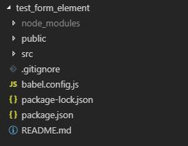
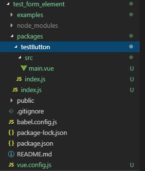

# 使用vue cli 3.0.4版本开发和发布npm组件

## 一、开发步骤
### 1、搭建项目
  <pre>vue create <你的项目名称></pre>
  在此省略使用vue cli 3.X的搭建项目的步骤，可以根据自身的需求进行设置， 
  当前选择的是：<b>default (babel, eslint)</b>

  安装后的文件目录如下：

  

  将src文件夹名称修改为examples

  在根目录下新建 packages 文件夹，在 packages 下创建要发布的组件包 testButton

  testButton文件夹中包含index.js(用于导出组件)和src/main.vue(组件的内容都写在此文件中)

  packages中的index.js主要是用于批量导出packages中的所有组件

  整理后的文件夹目录结构如下：

  
  
### 2、现在列下每个文件中的代码：

* 1、根目录下的vue.config.js

  <pre>
    module.exports = {
      // 将 examples 目录添加为新的页面
      pages: {
        index: {
          // page 的入口
          entry: 'examples/main.js',
          // 模板来源
          template: 'public/index.html',
          // 输出文件名
          filename: 'index.html'
        }
      },
      productionSourceMap: false
    }
  </pre>

* 2、testButton/src/main.vue(在此只是用于测试)
  <pre>
    &lt;template&gt;
      &lt;a class="btn btn-blue" href="javascript:void(0);" @click="fnClick"&gt;
        {{text}}
      &lt;/a&gt;
    &lt;/template&gt;

    &lt;script&gt;
      export default {
        name: 'TestButton',
        props: {
          text: {
            type: String,
            default: function () {
              return '';
            }
          }
        },
        methods: {
          // 按钮点击事件
          fnClick: function () {
            this.$emit('click');
          }
        }
      }
    &lt;/script&gt;

    &lt;style scoped&gt;
      .btn{
        display: inline-block;
        padding: 3px 12px;
        color: #8c8c8c;
        background: #ffffff;
        font-size: 14px;
        border: 1px solid #8c8c8c;
      }
      .btn.btn-blue{
        border: 1px solid #0079ff;
        color: #0079ff;
      }
      .btn.btn-red{
        border: 1px solid #ff5e5e;
        color: #ff5e5e;
      }
      .btn.btn-green{
        border: 1px solid #35a26c;
        color: #35a26c;
      }
      .btn:active{
        opacity: 0.75;
      }
    &lt;/style&gt;
  </pre>

* 3、testButton/index.js文件

  <pre>
  // 导入组件，组件必须声明 name
  import TestButton from './src/main.vue'

  // 为组件添加 install 方法，用于按需引入
  TestButton.install = function (Vue) {
      Vue.component(TestButton.name, TestButton)
  }

  export default TestButton
  </pre>

* 4、packages/index.js文件

  <pre>
  // 导入单个组件
  import TestButton from './testButton/index'

  // 以数组的结构保存组件，便于遍历
  const components = [
      TestButton
  ]

  // 定义 install 方法
  const install = function (Vue) {
      if (install.installed) return
      install.installed = true
      // 遍历并注册全局组件
      components.map(component => {
          Vue.component(component.name, component)
      })
  }

  if (typeof window !== 'undefined' && window.Vue) {
      install(window.Vue)
  }

  // **********这里不能写 export default, 会报错，可自己尝试
  export {
      // 导出的对象必须具备一个 install 方法
      install,
      // 组件列表
      TestButton
  }
  </pre>

* 5、有2种引入方式，一个是全局引入，一个按需引入

  【全局引入】

  只需在 examples/main.js中引入即可，代码如下：
  
  <pre>
    import Vue from 'vue'
    import App from './App.vue'

    // 在这边引入组件
    import {TestButton} from '../packages/index'
    Vue.use(TestButton)

    Vue.config.productionTip = false

    new Vue({
      render: h => h(App),
    }).$mount('#app')
  </pre>
  
  然后即可在应用的所有页面进行使用：
  
  <pre>
    &lt;test-button :text="'测试按钮'" @click="addListItem"&gt;&lt;/test-button&gt;
  </pre>

  【按需引入】

  在对应的页面中即可，在按需引入的时候，一直提示找不到组件，原因是在引入的时候，组件名称直接写 TestButton，正确要写成 {TestButton}
  <pre>
    // 在这边引入组件
    import {TestButton} from '../packages/index'

    export default {
      name: 'app',
      components: {
        TestButton
      }
    }
  </pre>

  自己在本地测试下组件是否有问题，若没有问题，下面便可以开始进行发包

## 二、npm发包步骤
* 1、package.json 中新增一条编译为库的命令
  
  在库模式中，Vue是外置的，这意味着即使在代码中引入了 Vue，打包后的文件也是不包含Vue的。

  <b>Vue Cli3 构建目标：库</b>

  以下我们在 scripts 中新增一条命令 npm run lib

  --target: 构建目标，默认为应用模式。这里修改为 lib 启用库模式。

  --dest : 输出目录，默认 dist。这里我们改成 lib

  [entry]: 最后一个参数为入口文件，默认为 src/App.vue。这里我们指定编译 packages/ 组件库目录。

  <pre>
    "scripts": {
        // ...
        "lib": "vue-cli-service build --target lib --name vcolorpicker --dest lib packages/index.js"
    }
  </pre>

  执行编译库命令

  <pre>
    $ npm run lib
  </pre>

* 2、配置 package.json 文件中发布到 npm 的字段
  
  name: 包名，该名字是唯一的。可在 npm 官网搜索名字，如果存在则需换个名字。

  version: 版本号，每次发布至 npm 需要修改版本号，不能和历史版本号相同。

  description: 描述。

  main: 入口文件，该字段需指向我们最终编译后的包文件。

  keyword：关键字，以空格分离希望用户最终搜索的词。

  author：作者

  private：是否私有，需要修改为 false 才能发布到 npm

  license： 开源协议

  <pre>
    "name": "test_form_element",
    "version": "1.0.1",
    "description": "发包测试",
    "main": "lib/testformelement.umd.min.js",
    "keyword": "testformelement test-form-element",
    "private": false
  </pre>

* 3、添加 .npmignore 文件，设置忽略发布文件

  我们发布到 npm 中，只有编译后的 lib 目录、package.json、README.md才是需要被发布的。所以我们需要设置忽略目录和文件。

  和 .gitignore 的语法一样，具体需要提交什么文件，看各自的实际情况。

  <pre>
    # 忽略目录
    examples/
    node_modules/
    packages/
    public/

    # 忽略指定文件
    vue.config.js
    babel.config.js
    *.map
  </pre>

* 4、登录到 npm
  
  首先需要到 npm 上注册一个账号，注册过程略。

  最快的方式是直接在官网上进行注册 [https://www.npmjs.com](https://www.npmjs.com)

  如果配置了淘宝镜像，先设置回npm镜像：

  <pre>
    $ npm config set registry http://registry.npmjs.org 
  </pre>

  然后在终端执行登录命令，输入用户名、密码、邮箱即可登录。

  <pre>
    $ npm login
  </pre>

* 5、发布到 npm
  
  执行发布命令，发布组件到 npm

  <pre>
    $ npm publish
  </pre>

* 6、使用新发布的组件库

  <pre>
    $ npm install test_form_element -S
  </pre>

  <pre>
    &lt;template&gt;
      &lt;div id="app"&gt;
        &lt;img alt="Vue logo" src="./assets/logo.png"&gt;
        &lt;p v-for="(item, index) in list" :key="index"&gt;{{item.name}}&lt;/p&gt;
        &lt;test-button :text="'测试按钮'" @click="addListItem"&gt;&lt;/test-button&gt;
      &lt;/div&gt;
    &lt;/template&gt;

    &lt;script&gt;
    // 导入单个组件
    import 'test_form_element/lib/testformelement.css';
    import {TestButton} from 'test_form_element';

    export default {
      name: 'app',
      components: {
        TestButton
      },
      data: function () {
        return {
          list: []
        };
      },
      methods: {
        addListItem: function () {
          let oldList = JSON.parse(JSON.stringify(this.list));

          this.list.push({
            name: 'test_' + (oldList.length+1)
          });
        }
      }
    }
    &lt;/script&gt;
  </pre>

## 参考
* 1、参考一 [http://www.rxshc.com/180.html](http://www.rxshc.com/180.html)
* 2、参考二 [https://www.cnblogs.com/wisewrong/archive/2018/12/28/10186611.html](https://www.cnblogs.com/wisewrong/archive/2018/12/28/10186611.html)

  